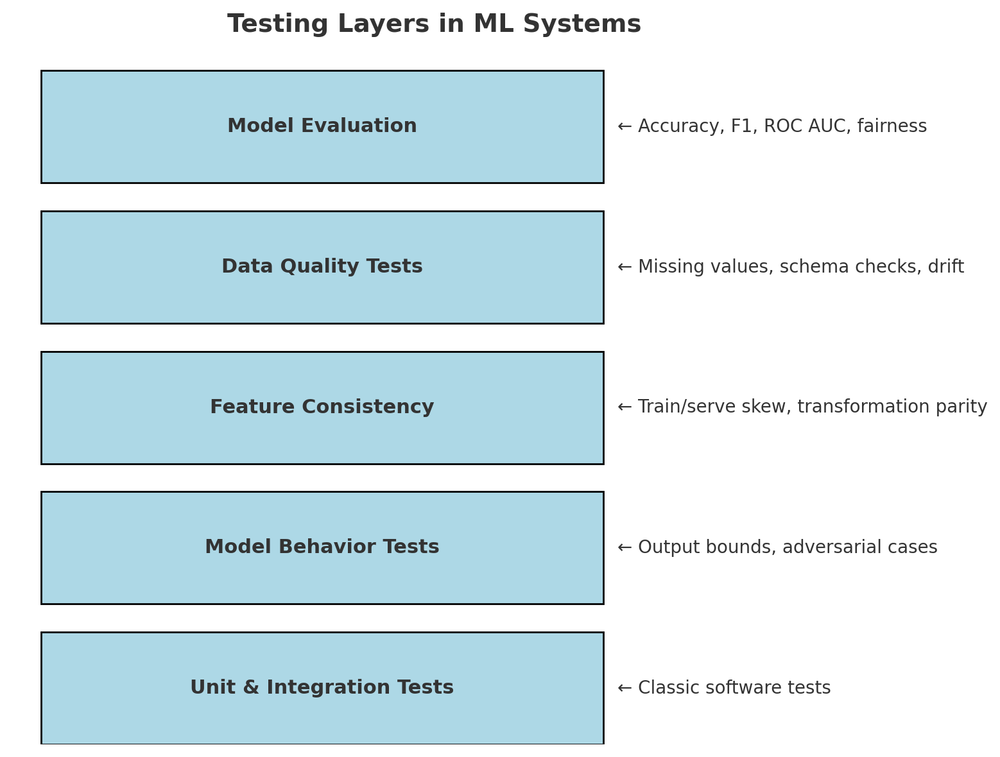
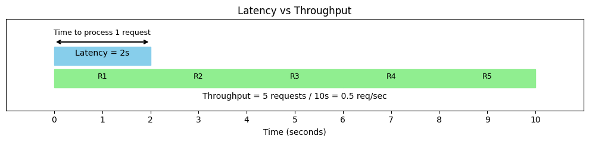

##  MLOps — Why It Matters and How It Works

> *“A machine learning model is like milk — fresh when new, but it spoils without care.”*

1. [Why MLOps?](#why-mlops)
2. [MLOps vs. DevOps (and Traditional Software)](#mlops-vs-devops-and-traditional-software)

   * [Experimental vs. Deterministic Development](#1️⃣-experimental-vs-deterministic-development)
   * [Testing Is More Complex](#2️⃣-testing-is-more-complex)
   * [Deployment & Continuous Updates](#3️⃣-deployment--continuous-updates)
   * [Production Degradation](#4️⃣-production-degradation)
   * [Lifecycle Is Cyclical](#5️⃣-lifecycle-is-cyclical)
3. [System-Level Concerns in ML Production](#system-level-concerns-in-ml-production)

   * [Latency & Throughput](#-latency--throughput)
   * [Data & Concept Drift](#-data--concept-drift)
   * [Reproducibility](#-reproducibility)
4. [ML Lifecycle](#the-ml-lifecycle)

### Why MLOps?

Machine learning models aren’t like static software — they live in a constantly changing world.
Once deployed, a model’s performance can degrade because:

* **User behavior changes** over time.
* **Data patterns shift** (a.k.a. drift).

MLOps (Machine Learning Operations) brings **DevOps principles** to the ML world — enabling smooth collaboration between data scientists and engineers, while automating the ML lifecycle with:

* Version control for code, data, and models
* Continuous integration & deployment (CI/CD)
* Automated testing and monitoring
* Reproducible experiments

Think of it as the bridge between **experimentation** and **reliable, scalable production ML**.

---

### MLOps vs. DevOps (and Traditional Software)

While DevOps deals with deterministic software systems, MLOps faces **extra moving parts**:

#### 1️⃣ Experimental vs. Deterministic Development

* ML workflows involve stochastic (random) results — you must **track experiments** and **version datasets/models**, not just code.

#### 2️⃣ Testing Is More Complex

* Traditional software: unit + integration tests.
* ML systems: add **data quality checks**, **model validation**, and **statistical performance tests**.

#### 3️⃣ Deployment & Continuous Updates

* Deploying ML isn’t just “ship the binary” — it’s **deploying a pipeline** that may retrain models regularly.

#### 4️⃣ Production Degradation

* **Data drift**: input data changes over time.
* **Concept drift**: the meaning of “correct prediction” changes over time.

#### 5️⃣ Lifecycle Is Cyclical

* After deployment, you often loop back to **data collection → retraining → redeployment**.
* Example: RLHF in LLMs is an ongoing cycle.

---

### System-Level Concerns in ML Production

#### ⚡ Latency & Throughput

* **Latency**: Time to generate a prediction after input.
* **Throughput**: Predictions per second the system can handle.
* Sometimes **speed > accuracy** in production.

**Optimization strategies:**

* Smaller/faster models (quantization, distillation)
* Hardware acceleration
* Scaling out
* Caching frequent queries

#### 🔄 Data & Concept Drift

* **Data Drift**: Input data distribution changes (e.g., summer → winter images).
* **Concept Drift**: The relationship between inputs and outputs changes (e.g., churn signals change after a major event).

#### 📦 Reproducibility

* The ability to **retrain** and get the same accuracy or **reproduce predictions** later.
* Requires:

  * Version control for **code, data, and models**
  * Containerized environments
  * Automated data/model validation tests

---

### The ML Lifecycle

From **idea to production and back again**:

1. Data Collection
2. Data Preprocessing
3. Model Training
4. Model Evaluation
5. Deployment
6. Monitoring
7. Retraining (loop back)

