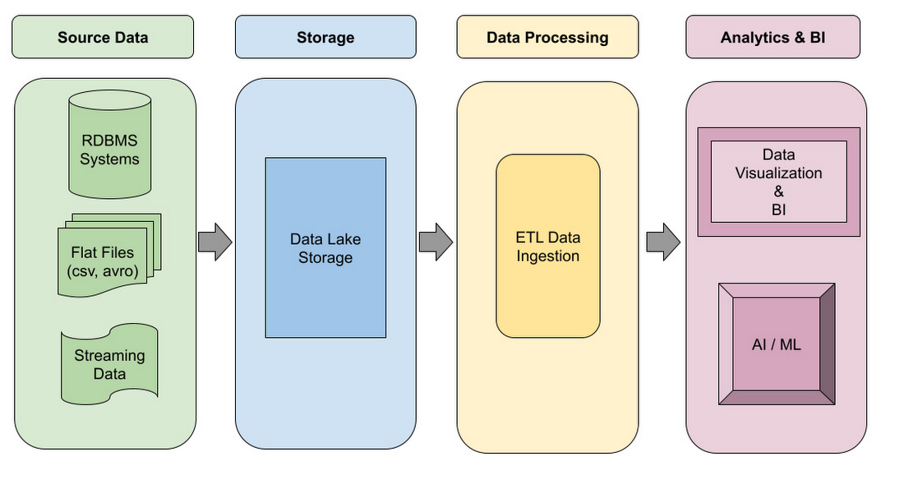
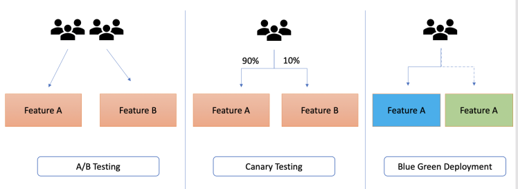
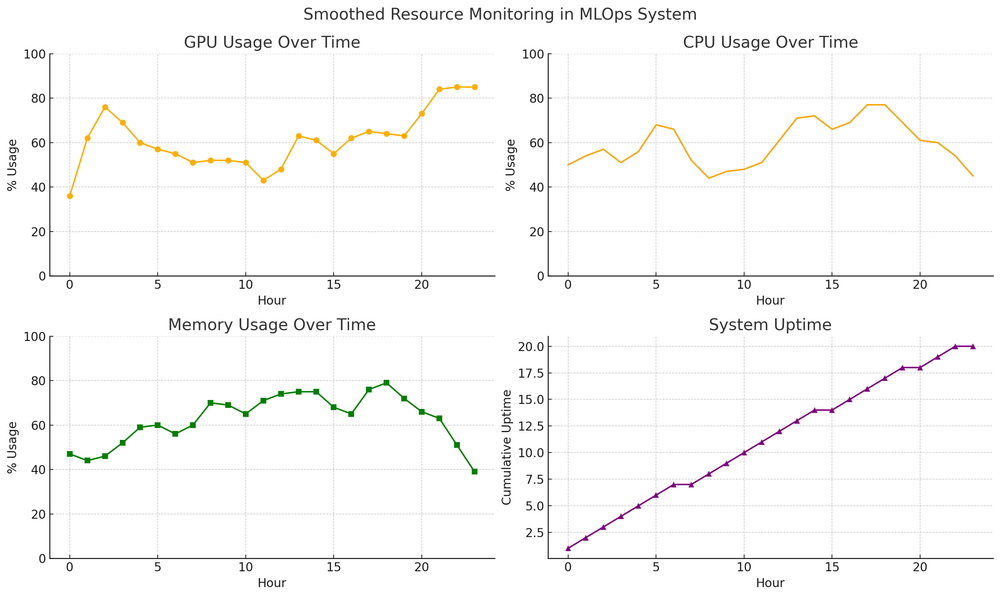

## Machine Learning System Lifecycle - Some Terms

> *“In ML, your model is only as good as the data pipeline and operations that support it.”*

### **1. Data Pipelines** — *The Foundation*

**Why it matters:**
Garbage in, garbage out. The majority of ML failures in production come from bad or inconsistent data, not the algorithm.

**Key components:**

* **Data Ingestion**

  * **Batch** — Periodic imports (daily, weekly, hourly)
  * **Streaming** — Real-time event processing
* **Data Storage**

  * Raw and processed versions
  * Data lakes (S3, GCS, HDFS) or relational DBs
* **Feature Store**

  * Central repository for precomputed features
  * Ensures **offline–online consistency**
* **ETL / Data Processing**

  * Cleaning, joining, feature engineering
  * Tools: Pandas, Spark
* **Labeling & Annotation**

  * Manual, semi-automated, or naturally collected labels
* **Data Versioning & Metadata**

  * Track dataset versions, schema, and checksums
  * Tools: DVC, ML metadata stores

**Offline vs Online Pipelines**

* **Offline** — Heavy batch jobs for training data
* **Online** — Lightweight, low-latency feature computation for real-time inference
* **Challenge:** Avoid **training-serving skew**

### **2. Model Training & Experimentation** — *Finding the Winner*

**Goals:**
Explore, measure, and select the best model with **rigor and reproducibility**.

**Core practices:**

* **Experiment Tracking**

  * Log code version, dataset, hyperparameters, metrics
  * Tools: MLflow, Weights & Biases
* **Model Validation**

  * Test on fresh hold-out sets
  * Domain review & bias checks
  * Use pre-defined acceptance criteria
* **Automated Training Pipelines**

  * Script the sequence: *data → preprocess → train → evaluate → push to registry*
* **Hyperparameter Tuning**

  * Grid search, random search, Bayesian optimization
* **Collaboration & Reproducibility**

  * Version control (Git) + environment management (Conda, Docker)

**Output:**
A **trained model artifact** + complete metadata for deployment.

### **3. Deployment & Inference** — *Putting Models to Work*

**Deployment patterns:**

* **Online / Real-Time** — Model served via API (Flask, FastAPI, gRPC)
* **Batch** — Periodic scoring of large datasets
* **Edge / Mobile** — Lightweight, optimized models on devices

**Key steps:**

* **Package Model** — Pickle, joblib, SavedModel, ONNX
* **Model Registry** — Store approved versions for production
* **Integration** — Connect to business systems, add fallbacks
* **Safe Rollouts** — Canary deployments & A/B testing
* **Scaling & Reliability**

  * Auto-scaling with Kubernetes
  * Health checks, logging, alerting

### **4. Monitoring & Observability** — *Keeping Models Healthy*

**What to monitor:**

* **Operational Metrics** — Latency, throughput, error rates, resource usage
* **Data Drift** — Statistical shifts in feature distributions
* **Concept Drift** — Changing relationships between input & output
* **Model Performance** — Using delayed ground truth or proxy metrics
* **Business KPIs** — Engagement, conversion, revenue impact

**Advanced techniques:**

* **Shadow Models** — Compare a new model silently in production
* **Automated Rollbacks** — Revert if performance degrades
* **Alerting & Runbooks** — Predefined incident response plans

---

### **5. Continuous Improvement** — *The Feedback Loop*

Once deployed, the journey isn’t over:

1. Monitor → Detect issues
2. Retrain → Validate improvements
3. Redeploy → Continue monitoring

This cycle keeps your models **fresh, relevant, and reliable**.

